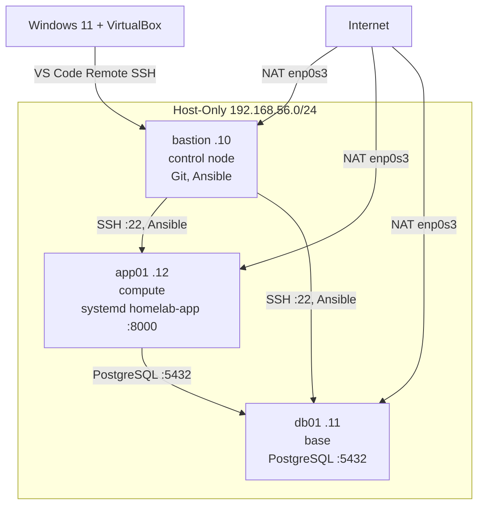

# Homelab DevOps

Локальный стенд для изучения DevOps: **3 VM Ubuntu Server**, управление с **Linux-bastion** (не с Windows).

## Цель

| Этап | Технологии |
|------|------------|
| Сейчас | Linux, Git, SSH, Ansible, systemd, hardening |
| Далее | OpenTofu (создание VM — обсудить с ментором) |
| Потом | Docker (только запуск), Kubernetes |

---

## Архитектура (3 VM)

### Логика (управление и сервисы)



> **Сейчас:** NAT включён на всех VM (apt/git). **План:** NAT только на bastion, app01/db01 — только host-only.

### Физическая сеть (2 NIC на каждой VM)

```
                         Internet
                             |
                    VirtualBox NAT
                   (enp0s3, 10.0.2.0/24)
              +--------------+--------------+
              |              |              |
         bastion .10     app01 .12      db01 .11
         10.0.2.15       10.0.2.15      10.0.2.15   ← у каждой VM свой NAT (не для меж-VM!)
              |              |              |
              +======== Host-Only vboxnet0 192.168.56.0/24 ========+
                     Ansible SSH, app → PostgreSQL, curl :8000
```

| VM | Host-only IP | Роль | Сервисы |
|----|--------------|------|---------|
| **bastion** | `192.168.56.10` | control node | Git, Ansible (отсюда `ansible-playbook`) |
| **db01** | `192.168.56.11` | base | PostgreSQL `5432` (listen только на `.11`) |
| **app01** | `192.168.56.12` | compute | `homelab-app.service` → HTTP `:8000` |

| Интерфейс | VirtualBox | Назначение |
|-----------|------------|------------|
| `enp0s3` | NAT | Интернет (apt, git) — позже убрать с app/db |
| `enp0s8` | Host-only | Связь между VM; **этот IP в `inventory/hosts`** |

Проверка: `ip -br a` на каждой VM. Ansible: `ansible_host` = host-only IP.

---

## Структура проекта

```
homelab-devops/
├── apps/demo-app/          # готовое приложение (stdlib, без правок)
├── ansible/
│   ├── inventory/
│   │   ├── hosts
│   │   └── group_vars/   # рядом с inventory (Ansible подхватывает отсюда)
│   ├── playbooks/site.yml
│   ├── requirements.yml    # ansible-galaxy collections
│   └── roles/
│       ├── common/         # базовые пакеты
│       ├── hardening/      # SSH, UFW, timezone, sysctl
│       ├── postgresql/     # БД на db01
│       └── app/            # systemd на app01
└── README.md
```

---

## Быстрый старт (на bastion)

```bash
git clone https://github.com/KopteloF/homelab-devops.git
cd homelab-devops
git checkout feature/homelab-stack   # или main после merge

# 1) Подставь свои IP и пользователя в ansible/inventory/hosts
nano ansible/inventory/hosts

# 2) SSH по ключам без пароля
ssh app01 'hostname'
ssh db01  'hostname'

# 3) Коллекции Ansible (один раз)
cd ansible
ansible-galaxy collection install -r requirements.yml

# 4) Dry-run
ansible servers -m ping
ansible-playbook playbooks/site.yml --check --diff \
  -e postgres_password='CHANGE_ME_STRONG'

# 5) Прогон
ansible-playbook playbooks/site.yml \
  -e postgres_password='CHANGE_ME_STRONG'
```

---

## Проверка после прогона

```bash
# Приложение (systemd)
ssh app01 'systemctl status homelab-app --no-pager'
curl http://192.168.56.12:8000/health

# PostgreSQL
ssh db01 "sudo -u postgres psql -c '\\l'"

# UFW — критерии «сделано» см. ниже
ssh app01 'sudo ufw status numbered'
ssh db01  'sudo ufw status numbered'
```

### UFW — что должно быть на db01

На **db01** incoming по умолчанию **deny**. Разрешено:

| # | Правило | Зачем |
|---|---------|--------|
| 22/tcp | SSH | Ansible с bastion |
| 5432/tcp **FROM 192.168.56.12** | PostgreSQL | **только app01**, не весь мир |

Проверка одной командой (на bastion):

```bash
ssh db01 'sudo ufw status numbered' | grep -E '22|5432|Default'
```

Ожидаемо: `22/tcp ALLOW`, `5432 ... 192.168.56.12`, `Default: deny (incoming)`.

Негативная проверка (postgres с bastion `.10` должен **не** проходить, если PG слушает только `.11` и UFW без лишних правил):

```bash
# с bastion — должна быть ошибка подключения (нет правила для .10)
psql -h 192.168.56.11 -U homelab -d homelab -c 'SELECT 1' || echo "OK: bastion не пускает"
```

На **app01**: allow `22/tcp`, allow `8000/tcp` (app), default deny incoming.

---

## Git-воркфлоу

- `feature/homelab-stack` → **Pull Request** → `main` (hardening + PostgreSQL + app + systemd)
- После merge: работа от `main`, новые фичи — новые ветки `feature/...`

---

## Статус

- [x] SSH, Git, Ansible (3 VM)
- [x] Hardening (роль)
- [x] Сетевая схема (README)
- [x] PostgreSQL на db01 (Ansible)
- [x] Приложение через systemd на app01
- [ ] OpenTofu — **вопрос на созвоне** (VirtualBox на Windows vs bastion)
- [ ] Docker
- [ ] Kubernetes

---

## OpenTofu (отложено до созвона)

> «Стенд готов руками. Хочу заменить создание VM на OpenTofu, но VirtualBox на Windows,
> а Ansible — с Linux-bastion. Какой способ ты рекомендуешь: provider VirtualBox,
> libvirt/KVM, Vagrant?»
